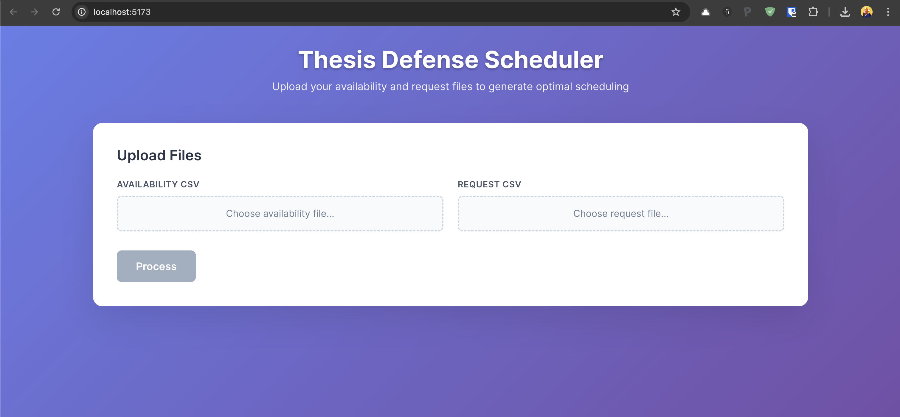

# Thesis Scheduling System (TA-Scheduler-IFITERA)

An intelligent thesis defense scheduling system that automatically assigns examiners and schedules thesis defense sessions based on lecturer availability and expertise matching.

## What's New! 🚀

### Version 1.0 - Major Updates

> **🎉 Web Interface Launch**: The system now features a complete web interface built with React and Flask, making it easier than ever to upload files and run scheduling operations through your browser.

### Latest Features & Improvements

#### 🌐 **New Web Interface**
- **Modern React Frontend**: Intuitive drag-and-drop file upload interface
- **Real-time Progress**: Live feedback during scheduling operations
- **Interactive Results**: View and download schedules directly from the browser
- **Automated Setup**: One-click environment setup with `setup.sh` and `start.sh` scripts
- **Responsive Design**: Works seamlessly on desktop and mobile devices

#### 📅 **Enhanced Scheduling Capabilities**
- **Sidang Akhir Support**: Now handles final defense sessions where examiners are pre-assigned
- **Improved Date/Time Display**: More human-readable Indonesian date and time formatting in all output files
- **30-Minute Precision**: Timeslots now operate on 30-minute intervals for more efficient scheduling while maintaining 1-hour input format for availability

#### 🐛 **Critical Bug Fixes**
- **Parallel Schedule Conflict**: Fixed the critical bug where one person could be assigned to two parallel schedules simultaneously
- **Data Integrity**: Enhanced validation to prevent scheduling conflicts and double-bookings

#### 🎓 **Capstone Project Enhancements**
- **Extended Timing Support**: Automatic duration adjustment based on capstone group size
   - 2 students: 90 minutes (3 slots)
   - 3 students: 120 minutes (4 slots)  
   - 4 students: 150 minutes (5 slots)
- **Group Consistency**: Ensures all students in a capstone group get the same examiners and time slot

#### ⚡ **Performance Improvements**
- **Efficient Time Management**: Scheduling operates on precise 30-minute intervals internally while maintaining user-friendly 60-minute input format in spreadsheets for easier availability entry

## Table of Contents
- [Overview](#overview)
- [Web Interface](#web-interface)
- [Installation](#installation)
- [Usage](#usage)
- [Input Files](#input-files)
- [Output Files](#output-files)
- [Scheduling Algorithm](#scheduling-algorithm)
- [Configuration](#configuration)
- [Development Workplan](#development-workplan)

## Overview

The Thesis Scheduling System is designed to automate the complex task of scheduling thesis defense sessions in academic institutions. The system considers multiple factors including:

- Lecturer availability and time constraints
- Academic field expertise matching
- Existing supervisor and examiner assignments
- Capstone project group requirements
- Time slot duration requirements
- Parallel event scheduling capabilities

## Web Interface

The system now includes a modern web interface built with React and Python Flask, providing an intuitive way to upload files, run the scheduling algorithm, and view results.



### Features
- **File Upload Interface**: Drag-and-drop or browse to upload availability and request CSV files
- **Real-time Processing**: Live feedback during scheduling process
- **Interactive Results**: View and download generated schedules
- **Responsive Design**: Works on desktop and mobile devices
- **Error Handling**: Clear feedback for file format issues or processing errors

## Installation

### Prerequisites
- Python 3.7 or higher
- Node.js 14 or higher (for web interface)
- pip package manager
- npm package manager

### Setup Instructions

#### Option 1: Web Interface (Recommended)

1. **Clone the repository:**
   ```bash
   git clone <repository-url>
   cd ta-scheduler-ifitera
   ```

2. **Navigate to the web interface directory:**
   ```bash
   cd ui/react_app
   ```

3. **Run the automated setup script:**
   ```bash
   chmod +x setup.sh
   ./setup.sh
   ```
   
   This script will:
   - Create a Python virtual environment for the backend
   - Install all Python dependencies (Flask, pandas, numpy, etc.)
   - Install Node.js dependencies for the React frontend
   - Set up the complete development environment

4. **Start the application:**
   ```bash
   chmod +x start.sh
   ./start.sh
   ```
   
   This will start both:
   - Backend API server at `http://localhost:5000`
   - Frontend React app at `http://localhost:5173`

5. **Open your browser:**
   Navigate to `http://localhost:5173` to use the web interface

#### Option 2: Command Line Only

1. **Clone the repository:**
   ```bash
   git clone <repository-url>
   cd ta-scheduler-ifitera
   ```

2. **Create a virtual environment (recommended):**
   ```bash
   python -m venv venv
   source venv/bin/activate  # On Windows: venv\Scripts\activate
   ```

3. **Install required dependencies:**
   ```bash
   pip install pandas numpy configparser
   ```

3. **Install required dependencies:**
   ```bash
   pip install pandas numpy configparser
   ```

4. **Create directory structure:**
   ```bash
   mkdir -p data/input data/output
   ```

5. **Prepare input files:**
   - Place your availability CSV file in `data/input/`
   - Place your request CSV file in `data/input/`
   - Update `config.ini` with correct file names

## Usage

### Web Interface Usage (Recommended)

1. **Start the application:**
   ```bash
   cd ui/react_app
   ./start.sh
   ```

2. **Open your browser:**
   Navigate to `http://localhost:5173`

3. **Upload your files:**
   - Click "Choose Files" or drag and drop your CSV files
   - Upload the availability file (lecturer availability data)
   - Upload the request file (thesis defense requests)

4. **Configure settings:**
   - Adjust parallel events if needed
   - Set time slot durations for different group sizes

5. **Run the scheduler:**
   - Click "Run Scheduler" button
   - Monitor the real-time progress

6. **Download results:**
   - View the generated schedules in the interface
   - Download the output files (CSV format)

### Command Line Usage

1. **Configure the system:**
   Edit `config.ini` to specify your input files and parameters:
   ```ini
   [FILES]
   avail_fname = your_availability_file.csv
   req_fname = your_request_file.csv
   ```

2. **Run the scheduler:**
   ```bash
   python src/main.py
   ```

3. **Check results:**
   Output files will be generated in `data/output/` directory.

### Command Line Execution
```bash
cd /path/to/ta-scheduler-ifitera
python src/main.py
```

## Input Files

### 1. Availability File (`avail3.csv`)

**Format:** CSV file with lecturer availability information

**Required columns:**
- `nama_dosen`: Lecturer name
- `kode_dosen`: Lecturer code/ID
- `sk_1`, `sk_2`, `sk_3`, `sk_4`: Expertise fields (skill areas)
- Time slot columns: `YYYYMMDD_HHMM` format (e.g., `20240315_0900`)

**Time slot values:**
- `TRUE`/`True`/`true`: Available
- `FALSE`/`False`/`false` or empty: Not available

**Example structure:**
```csv
nama_dosen,kode_dosen,sk_1,sk_2,sk_3,sk_4,20240315_0900,20240315_1000,...
Dr. John Doe,JD001,Machine Learning,Data Science,AI,NLP,TRUE,FALSE,...
Prof. Jane Smith,JS002,Software Engineering,Web Development,,,TRUE,TRUE,...
```

### 2. Request File (`req.csv`)

**Format:** CSV file with thesis defense requests

**Required columns:**
- `nim`: Student ID number
- `nama`: Student name
- `capstone_code`: Group code for capstone projects (empty for individual)
- `spv_1`: First supervisor code
- `spv_2`: Second supervisor code (optional)
- `examiner_1`: First examiner code (usually empty - to be assigned)
- `examiner_2`: Second examiner code (usually empty - to be assigned)
- `field_1`: Primary research field
- `field_2`: Secondary research field
- `status`: Initial status (usually empty)

**Example structure:**
```csv
nim,nama,capstone_code,spv_1,spv_2,examiner_1,examiner_2,field_1,field_2,status
12345678,Alice Johnson,A,JD001,JS002,,,Machine Learning,Data Science,
87654321,Bob Smith,,JD001,,,,Software Engineering,Web Development,
```

## Output Files

The system generates three main output files:

### 1. Final Output (`final_output2.csv`)
Contains scheduled thesis defense information with:
- Student details with assigned date/time
- Complete examiner assignments
- Indonesian-formatted dates and times
- Status indicating match quality

### 2. Timeslot Schedule (`final_timeslot2.csv`)
Shows the complete schedule with:
- Date and time slots
- Parallel event assignments
- Slot occupancy information

### 3. Lecturer Schedule (`final_lectureschedule2.csv`)
Displays lecturer workload with:
- Lecturer information
- Number of assignments
- Detailed schedule in Indonesian format

## Scheduling Algorithm

The system uses a sophisticated two-round scheduling algorithm:

### Round 1: Expertise-Based Matching

1. **Field Filtering:**
   - Filters lecturers based on expertise matching (`field_1` or `field_2`)
   - Removes already assigned supervisors from examiner pool

2. **Availability Analysis:**
   - Identifies common time slots between assigned actors (supervisors)
   - Considers required duration (individual: 2 slots, capstone: 3-5 slots)
   - Ensures consecutive time slot availability

3. **Lecturer Ranking:**
   Uses multi-criteria scoring system:
   - **Criteria A:** Schedule compatibility with assigned actors
   - **Criteria B:** Current workload (fewer assignments = higher score)
   - **Criteria C:** Overall availability (less available = higher priority)

4. **Assignment Process:**
   - Assigns top-ranked examiners
   - Updates timeslot occupancy
   - Records lecturer assignments

### Round 2: Availability-Only Matching

For unscheduled requests from Round 1:
- Removes expertise filtering requirement
- Uses same ranking criteria focusing on availability
- Marks assignments as "Time Match Only"

### Scheduling Logic Details

**Time Slot Management:**
- 30-minute intervals for precise scheduling
- Automatic consecutive slot allocation
- Parallel event support (configurable)

**Capstone Project Handling:**
- Groups students by `capstone_code`
- Ensures consistent examiner assignment across group
- Adjusts duration based on group size (2-4 students)

**Conflict Resolution:**
- Prevents double-booking of lecturers
- Validates time slot availability
- Maintains data integrity across related requests

## Configuration

The `config.ini` file contains all configurable parameters:

```ini
[FILES]
# Input files (placed in data/input/)
avail_fname = avail3.csv
req_fname = req3.csv

# Output files (generated in data/output/)
out_fname = final_output2.csv
out_timeslot = final_timeslot2.csv
out_lectureschedule = final_lectureschedule2.csv

[PARAMETERS]
# Number of parallel events per time slot
parallel_event = 1

# Default time slots for individual thesis (30-minute slots)
default_timeslot = 2

# Capstone project durations based on group size
capstone_duration_2 = 3  # 2 students = 3 slots (90 minutes)
capstone_duration_3 = 4  # 3 students = 4 slots (120 minutes)
capstone_duration_4 = 5  # 4 students = 5 slots (150 minutes)

# Time slot duration in minutes
time_slot_dur = 30
```

## Development Workplan

### Completed Features ✅
- [x] Core scheduling algorithm with two-round approach
- [x] Multi-criteria lecturer ranking system
- [x] Capstone project group handling
- [x] CSV input/output processing
- [x] Indonesian date/time formatting
- [x] Comprehensive data validation
- [x] Statistical reporting
- [x] Configuration management
- [x] Error handling and logging
- [x] **Web Interface Implementation**
  - [x] React frontend with modern UI
  - [x] Python Flask backend API
  - [x] File upload interface for CSV inputs
  - [x] Real-time scheduling progress display
  - [x] Interactive results visualization
  - [x] Download functionality for output files
  - [x] Automated setup script (`setup.sh`)
  - [x] Automated start script (`start.sh`)
  - [x] Responsive design for mobile and desktop
  - [x] Error handling and user feedback

### Planned Features 🚧

#### Phase 1: Enhanced Web Features
- [ ] **Advanced Web Interface**
  - [ ] Schedule editing capabilities
  - [ ] Conflict resolution interface
  - [ ] Export options (PDF, Excel)
  - [ ] Data validation feedback with detailed messages
  - [ ] Bulk file processing

#### Phase 2: Deployment
- [ ] **Production Deployment**
  - [ ] Cloud hosting setup (AWS/GCP/Azure)
  - [ ] Domain configuration
  - [ ] SSL certificate installation
  - [ ] Performance optimization
  - [ ] Monitoring and logging setup

#### Phase 3: Advanced Features
- [ ] **System Enhancements**
  - [ ] Database integration
  - [ ] User authentication system
  - [ ] API development for integration
  - [ ] Mobile app development
  - [ ] Automated email notifications

### Technical Architecture ✅

**Frontend:**
- React.js with modern hooks and functional components
- CSS3 with responsive design
- File upload with drag-and-drop support
- Real-time progress indicators

**Backend:**
- Python Flask web framework
- RESTful API design
- File processing endpoints
- Integration with existing scheduling algorithm

**Development Tools:**
- Automated setup script (`setup.sh`) for environment configuration
- Automated start script (`start.sh`) for running both frontend and backend
- Virtual environment management
- Development server with hot-reload

### Future Enhancements

**Deployment:**
- Docker containerization
- Cloud platform deployment
- CI/CD pipeline setup

## Contributing

1. Fork the repository
2. Create a feature branch (`git checkout -b feature/new-feature`)
3. Commit your changes (`git commit -am 'Add new feature'`)
4. Push to the branch (`git push origin feature/new-feature`)
5. Create a Pull Request

## License

This project is licensed under the MIT License - see the LICENSE file for details.

## Support

For questions or issues, please:
1. Check the documentation above
2. Review existing issues in the repository
3. Create a new issue with detailed information about your problem

## System Requirements

- **Python:** 3.7+
- **Node.js:** 14+ (for web interface)
- **Memory:** 512MB RAM minimum
- **Storage:** 100MB free space (increased for web interface dependencies)
- **OS:** Windows, macOS, or Linux

## Troubleshooting

**Common Issues:**

### Web Interface Issues:

1. **Setup Script Fails:**
   - Ensure Python 3.7+ and Node.js 14+ are installed
   - Check internet connection for downloading dependencies
   - Run `./setup.sh` with administrator privileges if needed

2. **Backend Won't Start:**
   - Verify virtual environment is activated: `source backend/venv/bin/activate`
   - Check if port 5000 is available
   - Install dependencies manually: `pip install Flask Flask-CORS pandas numpy`

3. **Frontend Won't Start:**
   - Ensure Node.js dependencies are installed: `npm install`
   - Check if port 5173 is available
   - Clear npm cache: `npm cache clean --force`

4. **File Upload Issues:**
   - Ensure CSV files have proper format and encoding (UTF-8)
   - Check file size limits (max 10MB per file)
   - Verify CSV headers match expected format

### Command Line Issues:

1. **File Not Found Error:**
   - Ensure input files are in `data/input/` directory
   - Check file names in `config.ini`

2. **Permission Errors:**
   - Ensure write permissions for `data/output/` directory

3. **Import Errors:**
   - Verify all dependencies are installed
   - Check Python version compatibility

4. **Data Format Issues:**
   - Validate CSV file structure
   - Ensure proper encoding (UTF-8)
